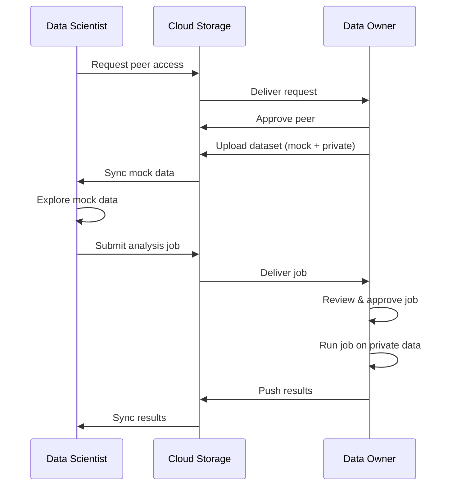

[](https://github.com/OpenMined/syft-client/actions/workflows/unit-tests.yml)
[](https://github.com/OpenMined/syft-client/actions/workflows/integration-tests.yml)
[](https://pypi.org/project/syft-client/)
[](https://github.com/OpenMined/syft-client)
[](https://github.com/OpenMined/syft-client/blob/main/pyproject.toml)

# Syft-client

Privacy-preserving data collaboration through file syncing. Syft-client lets **data owners** share datasets and run computations on private data for **data scientists** — all through cloud storage their organizations already use (Google Drive, Microsoft 365, etc.). No new infrastructure required.

## Features

- **Privacy-preserving** — Private data never leaves the data owner's machine; only approved results are shared
- **Transport-agnostic** — Works over Google Drive today, extensible to any file-based transport
- **Offline-first** — Full functionality even when peers are offline; changes sync when connectivity resumes
- **Peer-to-peer with explicit auth** — Data owners must approve each collaborator before any data flows
- **Isolated job execution** — Jobs run in sandboxed Python virtual environments with controlled access to private data
- **Dataset sharing with mock/private separation** — Data scientists explore mock data, then submit jobs that run on the real thing

## How it works

Syft-client uses a **two-role model**: a Data Owner (DO) hosts private data and controls access, while a Data Scientist (DS) explores shared mock data and submits analysis jobs. All communication happens through synced files — no servers, no APIs, just files in cloud storage.



## Quick Start

```
uv pip install syft-client
```

```python
import syft_client as sc
```

| Step | Data Owner | Data Scientist |
|------|-----------|----------------|
| **Login** | `do = sc.login_do(email="do@org.com")` | `ds = sc.login_ds(email="ds@org.com")` |
| **Connect** | `do.approve_peer_request("ds@org.com")` | `ds.add_peer("do@org.com")` |
| **Share data** | `do.create_dataset(name="census", mock_path="mock/", private_path="private/", users=["ds@org.com"])` | `ds.datasets.get_all()` |
| **Run analysis** | `do.jobs[0].approve()` | `ds.submit_python_job(user="do@org.com", code_path="analysis.py")` |
| **Execute** | `do.process_approved_jobs()` | |
| **Get results** | | `ds.jobs[-1].stdout` |

## Packages

| Package | Description |
|---------|-------------|
| [`syft-datasets`](packages/syft-datasets) | Dataset management and sharing |
| [`syft-job`](packages/syft-job) | Job submission and execution |
| [`syft-permissions`](packages/syft-permissions) | Permission system for Syft datasites |
| [`syft-perm`](packages/syft-perm) | User-facing permission API for Syft datasites |
| [`syft-bg`](packages/syft-bg) | Background services TUI dashboard for SyftBox |
| [`syft-notebook-ui`](packages/syft-notebook-ui) | Jupyter notebook display utilities |

## Development

```bash
# Install in development mode
uv pip install -e .

# Run tests
just test-unit          # Unit tests (fast, mocked)
just test-integration   # Integration tests (slow, real API)
```

---

Built by [OpenMined](https://openmined.org) — building open-source technology for privacy-preserving data science and AI.
