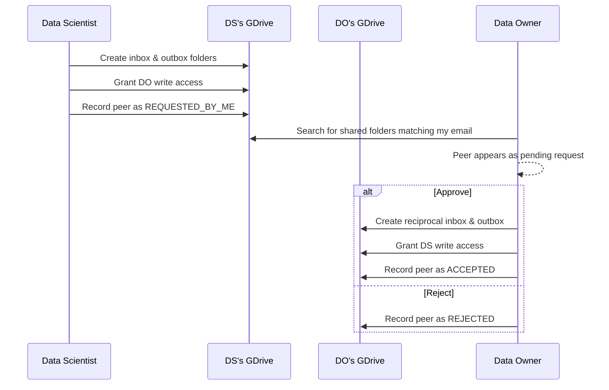
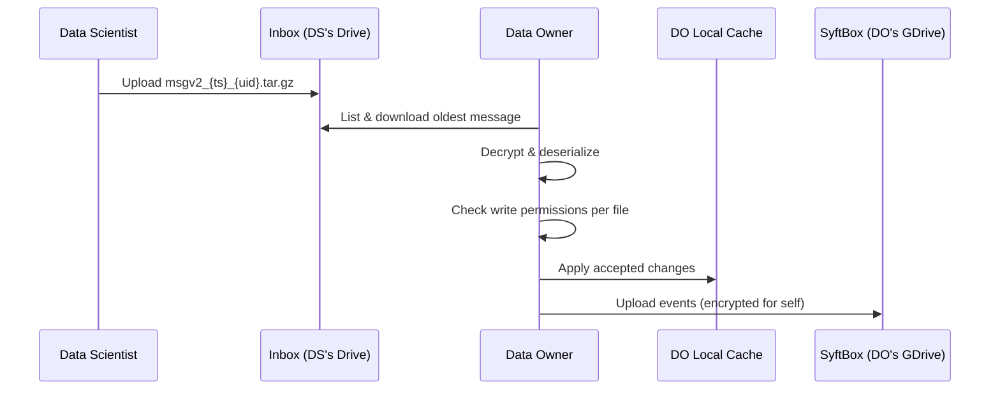
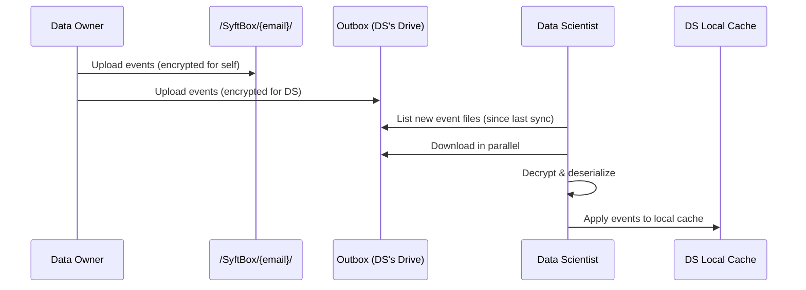
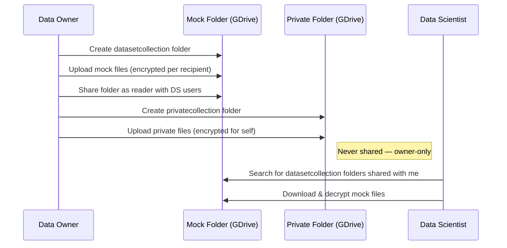
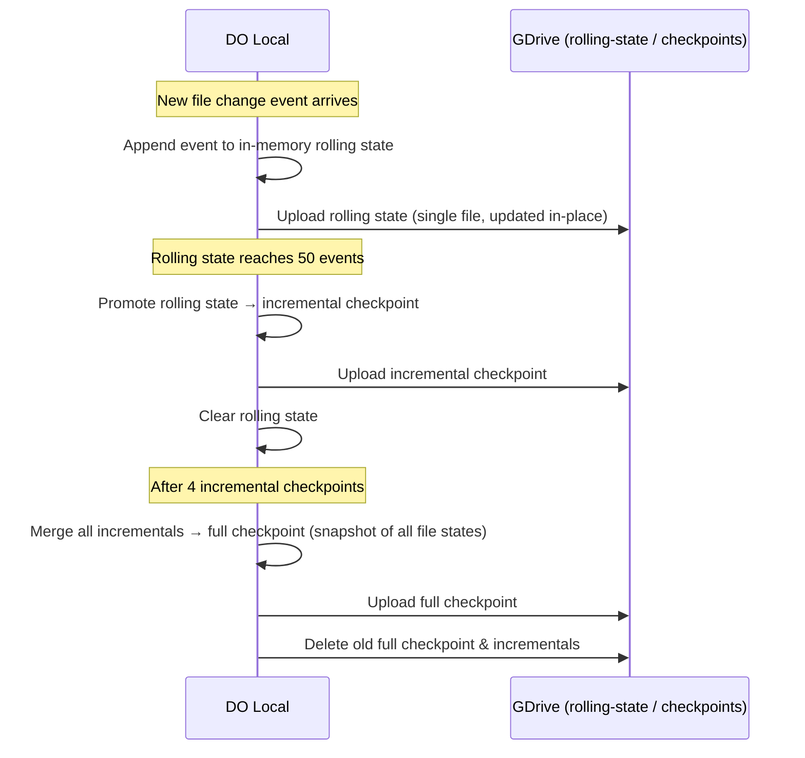

# Connections — Google Drive Transport

Syft-client uses Google Drive as its file-based transport layer. All peer-to-peer communication happens through shared GDrive folders.

## Folder Structure & Permissions

**Per-peer folders** — one inbox and one outbox per peer connection:

```
/SyftBox/
├── syft_datasite#{peer}#inbox#{me}/                   # DS creates, shares write with DO
├── syft_datasite#{peer}#outbox#{me}/                  # DS creates, shares write with DO
```

**Aggregated state** — combined data from all peers, stored on the DO's own drive:

```
/SyftBox/
├── {my_email}/                                        # Event log (all peers)
├── {my_email}-checkpoints/                            # Checkpoints (all peers)
├── {my_email}-rolling-state/                          # Rolling state (all peers)
```

**Dataset folders:**

```
/SyftBox/
├── syft_datasetcollection_{tag}_{hash}/               # Mock data — shared as reader with DS
├── syft_privatecollection_{tag}_{hash}/               # Private data — owner-only, never shared
```

**Encryption bundles** — public keys only, no secrets:

```
/SyftBox/
└── syft_encryption_bundles#{email}/                   # Public keys — shared as reader with peers
    └── encryption_bundle_{owner}_for_{peer}.json
```

| Folder                                        | Scope       | Owner | Shared with | Access |
| --------------------------------------------- | ----------- | ----- | ----------- | ------ |
| `inbox`                                       | per peer    | DS    | DO          | writer |
| `outbox`                                      | per peer    | DS    | DO          | writer |
| `event log` / `checkpoints` / `rolling-state` | all peers   | DO    | nobody      | —      |
| `datasetcollection`                           | per dataset | DO    | DS users    | reader |
| `privatecollection`                           | per dataset | DO    | nobody      | —      |
| `encryption_bundles`                          | per user    | user  | peers       | reader |

---

## Peer Requests

DS creates inbox/outbox folders on their own drive and grants the DO write access. The DO discovers these folders by searching for `syft_datasite#{my_email}#` folders they don't own.



---

## Receiving Files (DS → DO)

Each peer has its own inbox folder. The DO downloads proposed changes from a single peer's inbox, validates permissions, applies to the local cache, and uploads the resulting events to the aggregated SyftBox event log (which contains state from all peers).



---

## Sending Changes (DO → DS)

The aggregated SyftBox event log contains state from all peers. The DO pushes events from it to each peer's individual outbox folder.



---

## Uploading Datasets

Mock data is shared with DS users as readers. Private data stays owner-only.



---

## Checkpoints

The DO's state is built from **file change events** — each event records a file path, its content, and hashes. As events accumulate, we need to persist them so we can restore state without replaying everything from scratch.

**The problem:** Google Drive has strict rate limits (~50 files per listing). Storing each event as a separate GDrive file quickly hits that limit. But compacting everything into a single large file and re-uploading it on every change makes individual API calls slow.

**The solution:** Three tiers that balance upload size vs. file count:



| Tier              | What it stores                      | Trigger                         | GDrive file                                    | Retained        |
| ----------------- | ----------------------------------- | ------------------------------- | ---------------------------------------------- | --------------- |
| **Rolling state** | Recent events since last checkpoint | Every event                     | `rolling_state_{ts}.tar.gz` (updated in-place) | 1               |
| **Incremental**   | Batch of 50 events                  | Rolling state reaches 50 events | `incremental_checkpoint_{seq}_{ts}.tar.gz`     | Up to 4         |
| **Full**          | Snapshot of all file states         | 4 incrementals accumulated      | `checkpoint_{ts}.tar.gz`                       | 1 (old deleted) |

**File structures** (all stored as compressed `.tar.gz`):

```jsonc
// Rolling State & Incremental Checkpoint — store events
{
  "email": "do@org.com",
  "timestamp": 1234567890.0,
  "events": [
    {
      "path_in_datasite": "public/data.csv",
      "content": "...",
      "old_hash": "abc...",
      "new_hash": "def...",
      "is_deleted": false,
      "timestamp": 1234567889.0
    }
  ]
}

// Full Checkpoint — stores file snapshots (no event history)
{
  "email": "do@org.com",
  "timestamp": 1234567890.0,
  "last_event_timestamp": 1234567889.0,
  "files": [
    {
      "path": "public/data.csv",
      "hash": "def...",
      "content": "..."
    }
  ]
}
```

**Restore sequence** on initial sync:

1. Download latest **full checkpoint** from GDrive → apply all file states to local cache
2. Download **incremental checkpoints** (sorted by sequence) → replay events on top
3. Download **rolling state** → replay remaining events
4. Download any **event log files** newer than last known timestamp

All checkpoint data is encrypted for self before upload.
