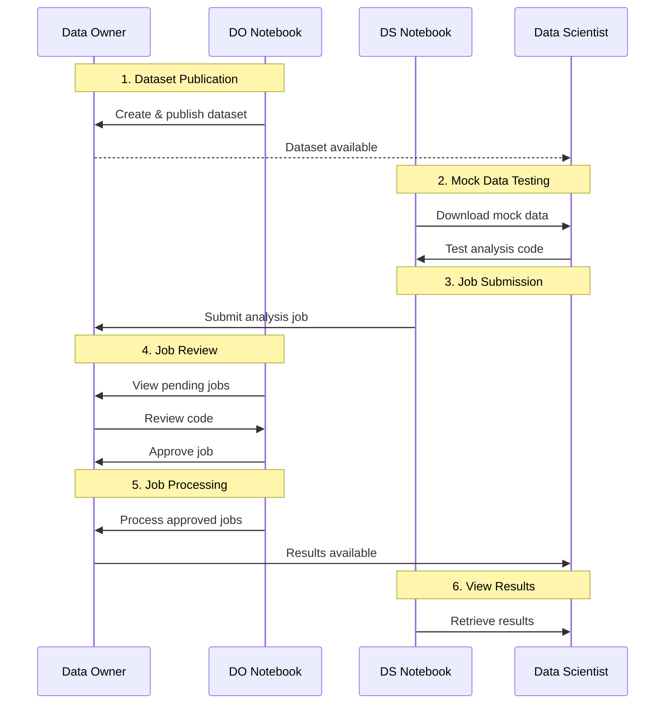

# Privacy-Preserving Data Analysis Workflow

The following diagram demonstrates the complete workflow for privacy-preserving data analysis using Beach Notebooks, involving both the Data Owner (DO) and Data Scientist (DS).

## Workflow Steps

1.  **Dataset Publication**: The Data Owner publishes a dataset with both mock (public) and private components.
2.  **Mock Data Testing**: The Data Scientist downloads the mock data to explore the structure and test their analysis code locally.
3.  **Job Submission**: Once satisfied with the code on mock data, the Data Scientist submits the analysis job to the Data Owner.
4.  **Job Review**: The Data Owner views pending jobs, reviews the code for safety and privacy, and approves it.
5.  **Job Processing**: The Data Owner processes the approved jobs, executing the code on the private data in a controlled environment.
6.  **View Results**: The Data Scientist retrieves the results of the analysis.
