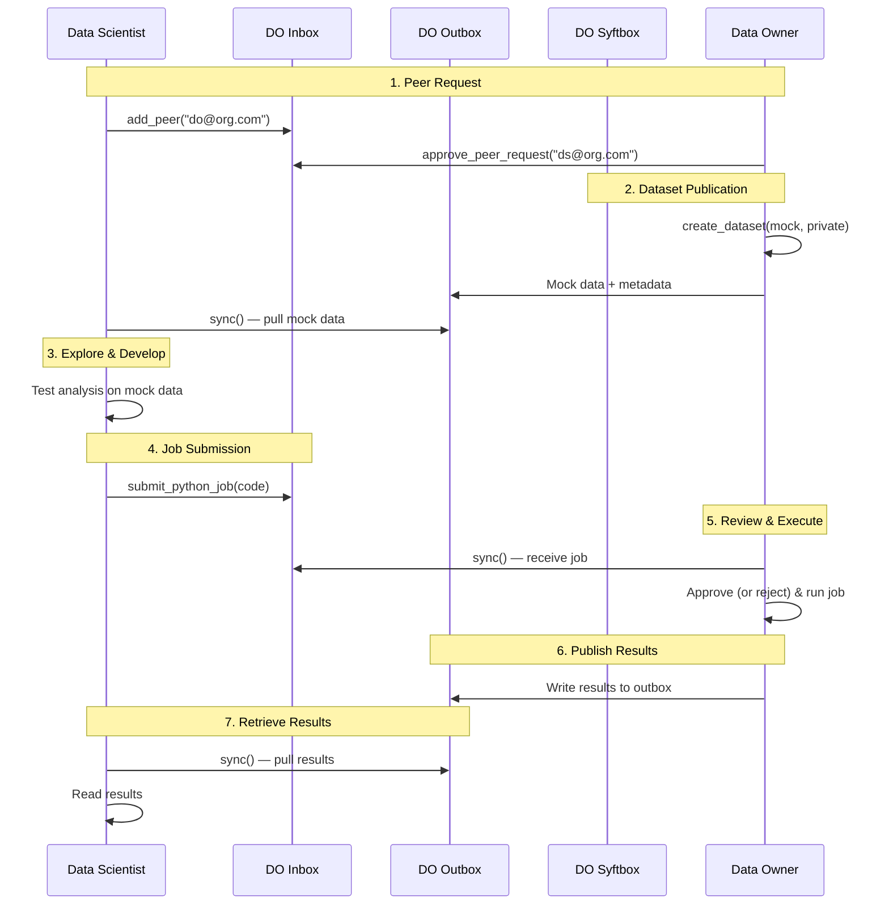

# Privacy-Preserving Data Analysis Workflow

## Workflow Steps

1. **Peer Request**: The Data Scientist requests access to the Data Owner's datasite. The Data Owner reviews and approves the request.
2. **Dataset Publication**: The Data Owner publishes a dataset with both mock (public) and private components. Mock data is placed in the outbox for Data Scientists to pull.
3. **Explore & Develop**: The Data Scientist downloads the mock data to explore the structure and test their analysis code locally.
4. **Job Submission**: The Data Scientist submits analysis code via the Data Owner's inbox.
5. **Review & Execute**: The Data Owner syncs to receive the job, reviews the code, and approves (or rejects) and runs it on private data.
6. **Publish Results**: The Data Owner writes job outputs to the outbox for the Data Scientist to pull.
7. **Retrieve Results**: The Data Scientist syncs to pull the results.
