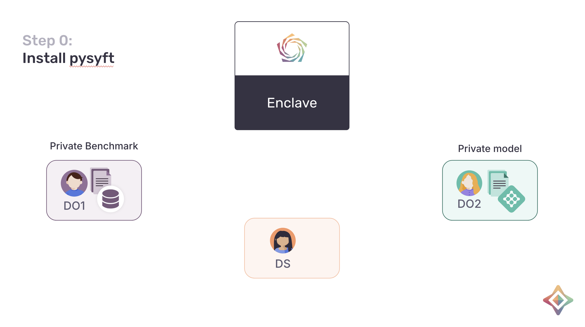
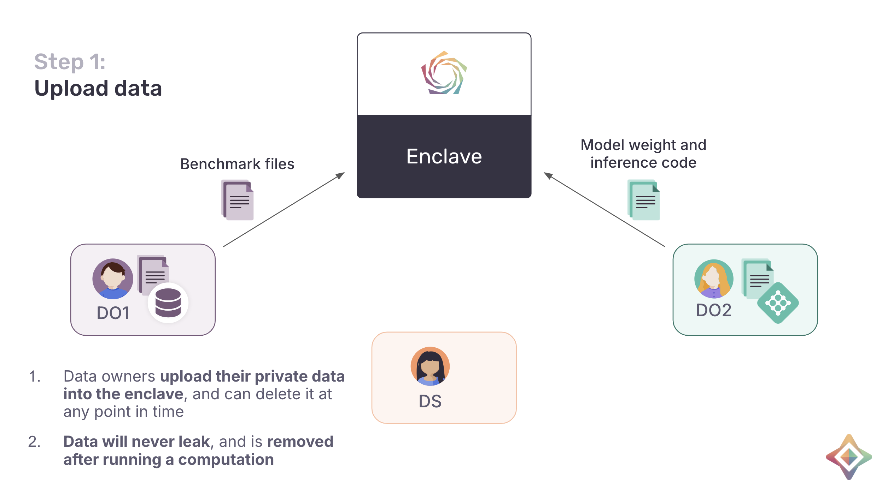
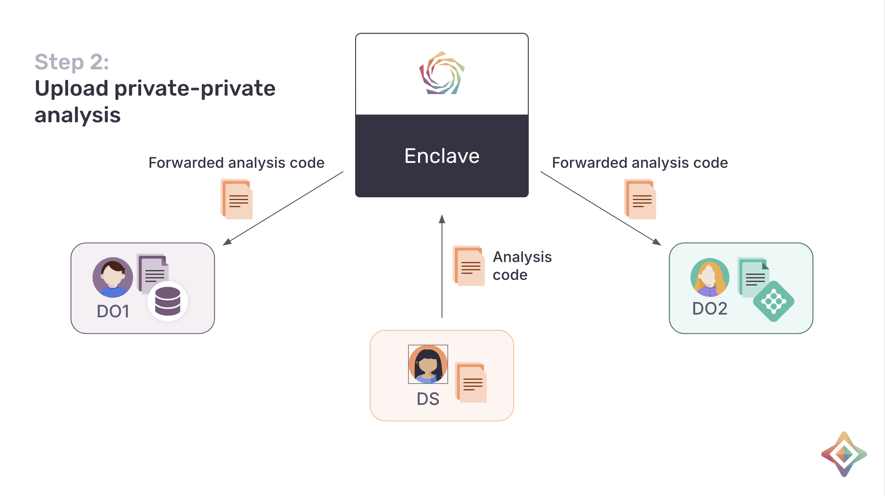
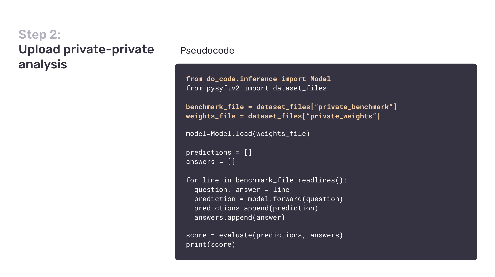
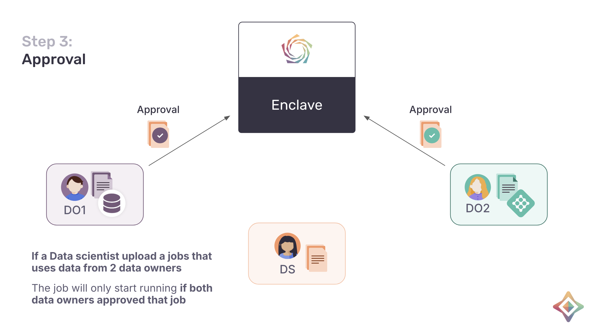
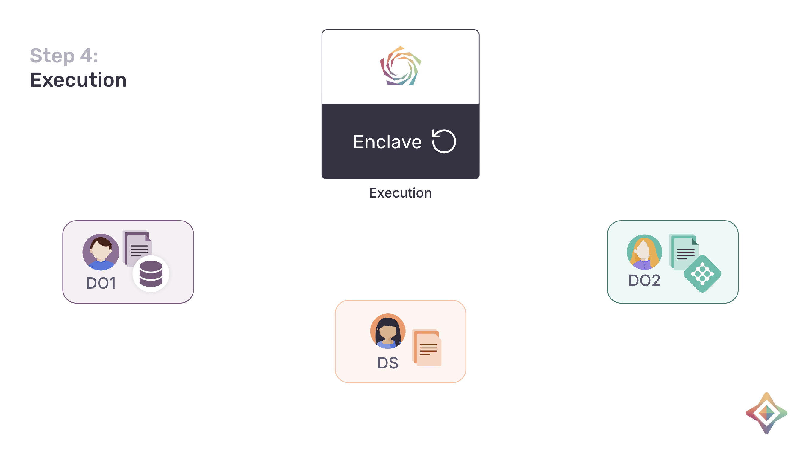
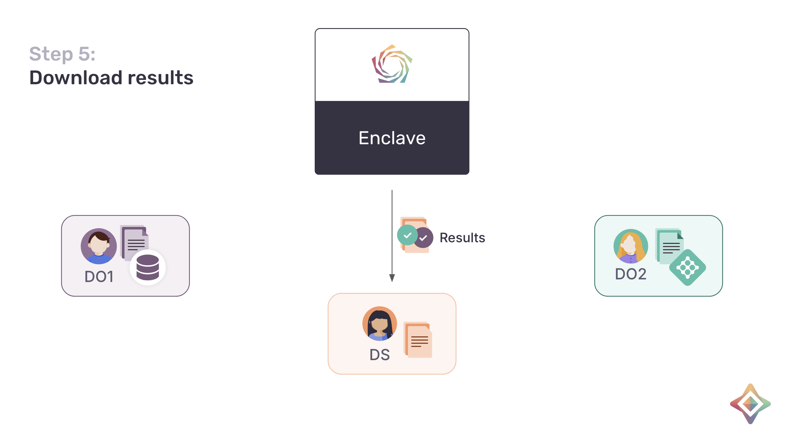

# Security Overview

This document provides a concise, accessible overview of how private collaboration works on in `syft-enclave` and the principles that make it secure. It is meant for a broad audience: you do not need to
know the internals to follow along. Users connect via **Jupyter or Google Colab** and sync through **Google Drive**. Using this as communication platofrm,
several parties can compute on each other's data. Backed by **confidential compute**, a **secure
enclave** running an **open-source docker container with syft-client** runs computations from those parties **without any of them having to reveal that
data**.

> **Where we are.** This is an early **alpha** release — a deliberate zero-to-one effort. The goal
> right now is not scale; it is to push the _Overton window_ of what private collaboration is allowed
> to look like: to demonstrate that two organizations and an outside analyst really can run a joint
> computation where nobody hands over their secrets. Everything below is built around that
> **mutual-secrecy** guarantee.

---

## Part A — The collaboration, end to end

Throughout the story there are three parties:

- **DO1** — a data owner who holds a private **benchmark** (for example, loaded in Google Colab).
- **DO2** — a data owner who holds a private **model and its inference code** (also, say, in Colab).
- **DS** — a data scientist who writes the **analysis** that brings the two together.

In the middle sits a **secure enclave**: a sealed, confidential-compute environment that nobody
logs into and that runs a known, open-source docker container.

### Step 0 — Everyone installs PySyft

All parties install the same open-source client (PySyft). DO1 brings a private benchmark, DO2
brings a private model and inference code, and the DS will bring the analysis. The secure enclave
is the neutral ground where the computation will eventually happen — none of the three parties
controls it.

### Step 1 — Data owners upload their data

Each data owner uploads their private asset toward the enclave (the bytes travel through Google
Drive). The data is only ever used inside the enclave: **it never leaks to the other parties, it is
removed after the computation, and an owner can delete it at any time.**

### Step 2 — The data scientist uploads a private-private analysis

The DS writes the analysis — the code that loads the benchmark, runs it against the model, and
scores the result — and uploads it. The enclave forwards this code to **both** data owners so they
can see exactly what is being proposed against their data before anything runs.

The analysis is just ordinary code. In pseudocode it reads the benchmark, runs the model's
inference on it, and reports a score:

### Step 3 — Data owners approve the analysis

Because this analysis touches data from two different owners, it only runs once **both** owners
have approved it. Either owner can decline. Nobody — not the DS, not the other owner, not the
operators of the enclave — can force a computation to run over data without that data owner's
explicit consent.

### Step 4 — The enclave executes the analysis

With both approvals in hand, the enclave runs the analysis inside its open-source docker container
on confidential-compute hardware. The two private inputs meet only here, inside the sealed
environment — never on anyone's laptop and never in plaintext on Google Drive.

### Step 5 — The result is shared with the DS

Only the agreed-upon output leaves the enclave and is delivered to the DS. The private benchmark
and the private model stay where they started. Everyone got something — a result — and nobody had
to give up their secret to get it.

---

## Part B — How the security works

Part A describes the flow. The following section describes how we make this secure

### 1. SyftBox and permissions

The basic unit is a **SyftBox**: a local folder of files. Every file carries **read and write
permissions for each peer**, which decide who is allowed to see or change it. `syft-client`
expresses those permissions in small **permission files** with a `.gitignore`-like syntax — patterns that say who
can read or write which paths. Most of the time you do not edit them by hand: higher-level
components (the enclave package, the job package) manage them for you, though a user can always set
them directly.

`syft-client` uses the permissions to decide **which files to share with which
peers over Google Drive** — only the files a peer is allowed to read are ever synced to them.

See the [permissions guide](../../syft-permissions/docs/permission-user-docs.md) for the full
syntax.

### 2. Peer-to-peer file sharing

Communication between parties is **transport-agnostic** — it works over any mechanism that can
deliver a file. Today that transport is **Google Drive**. `syft-client` makes "requests" simply by
uploading and downloading shared files: to files with another party, it creates a folder
that both parties can access and uploads the file into it. That is the whole channel — no dedicated
servers, just shared files.

See the [Google Drive connection doc](../../../docs/connections.md) for the folder layout and request flow.

### 3. All files are encrypted and signed

Every file `syft-client` exchanges is **encrypted and signed**. The signature lets the recipient
**cryptographically prove who** produced a file. Encryption means that even if a file is accidentally shared with the wrong person, it is
**unreadable** to them. The shared Google Drive folder is just a delivery mechanism; the security
does not depend on Google Drive keeping anything secret.

### 4. Attestation bootstraps the encryption handshake

Encryption and signing only help if you know whose keys to trust. For a **person**, this is relatively trivial:
if a real human controls a Google Drive account, `syft-client` can reasonably assume that what comes
from that account came from them — trust is bootstrapped from the fact that the account is human-operated.

An **enclave is different on purpose**: it must _not_ be controllable by any single person — that is
the entire point of using one. And no one can fully guarantee that no individual has access to the
enclave's Google Drive account, so that account cannot be trusted the way a person's is.

To get around this, the enclave builds a **secure channel out of the insecure account** using **attestation**.
An attestation report is a cryptographically signed statement from the confidential-compute hardware
that says, in effect, _"this exact, open-source docker container (with syft inside it) is what is
running here."_ The enclave generates a fresh encryption and signing keypair, **embeds its public
keys into that attestation report**, and shares the report on Google Drive with all peers.

Because any peer can **verify the attestation report**, they know those public keys were genuinely
produced by an enclave running the expected open-source container — not by some person who happens to
have access to the account. The data owners and the DS then download the enclave's verified keys (and
share their own), and from that point on there is a **trusted, end-to-end secure channel** between the
enclave and every participant.

Crucially, Google Drive is treated purely as an **untrusted transport** — a message-passing channel
and nothing more. The threat model assumes a fully adversarial transport: an attacker (or Google
itself) is presumed able to **read, drop, replay, reorder, or tamper with** anything stored there.
The system does not rely on Google Drive for confidentiality, integrity, or authenticity. Those
properties are enforced end to end by the layers above it — **encryption** protects confidentiality,
**signatures** provide integrity and authenticity (so any tampering is detected and rejected), and
**attestation** anchors the trust to a known enclave. Compromising the transport therefore lets an
adversary at most cause a denial of service; it never yields access to plaintext or the ability to
forge an accepted message.

This is what lets Steps 1–5 happen without anyone trusting Google Drive, the network, or each other.

For the enclave deployment details, see the
[enclave architecture doc](./enclave_architecture.md).
